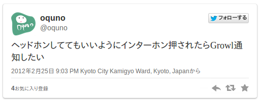
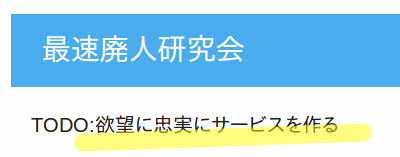
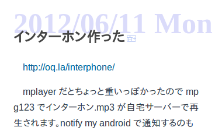
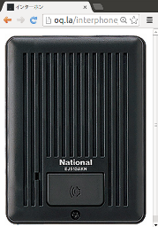

# The Internet Intercom
## インターネット・インターホン

 
 

[ [第3回プログラム勉強会in富山](http://twipla.jp/events/57843) ]   
 
2013-08-18 [@toby_net](https://twitter.com/toby_net) (諸事情枠) 

----

## The origins

発端

 

 

* Notify **to** <u>Growl</u>?
* Ping **from** <u>internet</u>?

----

## I am a slave to programmable intercoms.

好きなところから好きな方法でインターホンを利用したいという極めて原始的な欲求

----

## <q>&ldquo; All our intercom are belong to us &rdquo;</q>
### <q>「私達のインターホンは、全てインターネットがいただいた。」</q>

<!--
## <q>&ldquo; All our intercom are belong to internet. &rdquo;</q>
### <q>「私達のインターホンは、  全てインターネットがいただいた。」</q>
-->

----

## the provided API ⇒  Machine Friendly

プログラマブル ⇒  機械に優しい

----

## Machine Friendly ⇒  It is nice to Next Generation Human

機械に優しい ⇒ インターネット人間に優しい

----

## RESTful intercoms

レストフル・インターホン

---

## <s>RESTful</s> intercoms

<s>レストフル</s>・インターホン

---

## !?

！？

---

## *not* RESTful intercoms

＿人人人人人人＿ 
＞  諸事情により ＜ 
￣ＹＹＹＹＹＹＹ￣

特にレストフルでない「ふつうの」プログラマブル・インターホン

----

## e.g. the intercom is now available on your smartphone

実装例: スマートホンで押せるインターホン

---

## Then again...

と思いきや....

---

※ 既存の実装があった

(製作者さまにお聞きした所、ソフトウェア実装のインターホンの様子でした。本物と連携する予定はあるとのこと)

---

## E.G. the intercom is now available on Twitter or HipChat

実装例: Twitterやチャットから使えるインターホン

----

## ((( the demonstration )))

 ((( デモ )))

----

## Code sample

((( コードのサンプル )))

----

## Impressions 

* The **hardware** is <u>hard to release and clone</u>. (；´Д｀)
* **Raspberry Pi** is a <u>really Linux box</u>. (^O^)
    * But, we can not emulate on Virtual Machine.(ARM is not x86)
* It is **hard to connect network** with <u>wireless USB Adapter</u> ＞＜;;
    * unstable....

----

技術的なことは雑談で！

----

## ... Technologies Memo(1/3) ...

* Raspberry Pi (model B) + Debian ⇒  <u>小型のLinux機がいくつかたまたま手元にあった</u>
    * 死ぬほど熱い USB WiFi モジュール
    * 電源容量が足りない!!
    * [Sunzi](https://github.com/kenn/sunzi) ⇒ Server Provisioning Tool(サーバー設定の自動化を補助)
    * [serverspec](http://serverspec.org/) ⇒  サーバーのテストツール
* Ruby 1.9+
    * <s>internetintercom gem ⇒ これ用に作ったインターホン用DSLライブラリ</s> ⇒ not yet implemented
    * [Chatroid gem](https://github.com/r7kamura/chatroid/) ⇒  botを簡単に作るためのDSL
    * [pi_piper gem](https://github.com/jwhitehorn/pi_piper/) ⇒ イベントベースで書けるGPIOライブラリ

----

## ... Technologies Memo (2/3) ...

* Knowledge of electricity ⇒ <u>電気の勉強中だったので、モチベーションの向上、実際の応用にも都合がよかった</u>
    * Hack the intercom ⇒ 手元にあったファミマの音が鳴るインターホンを回路を追って結線
        * ボタンが押されたときに繋がる線を切断して取り出す
        * スイッチを結線する用の線を取り出す
    * トランジスタ(BJT)を使った教科書的な簡単な回路を作成
    * インターホン(ファミマ) ⇔ 回路 ⇔ サーバー(RaspberryPi)
    * [Mouser](http://jp.mouser.com/), [秋月電子通商](http://akizukidenshi.com/) ⇒ 電子パーツ屋。前者は海外(いい機会なので利用してみた)

----

## ... Technologies Memo (3/3) ...

* [reveal.js](https://github.com/hakimel/reveal.js/) ⇒ このプレゼン
    * HTMLで書いて、印刷すれば配布用のPDFにできる
    * 手元で node.js が動けば 外部においた Markdown でほとんど書ける ⇒  ただし、閲覧時は node.jsが動いていないといけない……

* <s>Web UI</s> ⇒ 次回にでも

----

# THE END

―  完 ―

